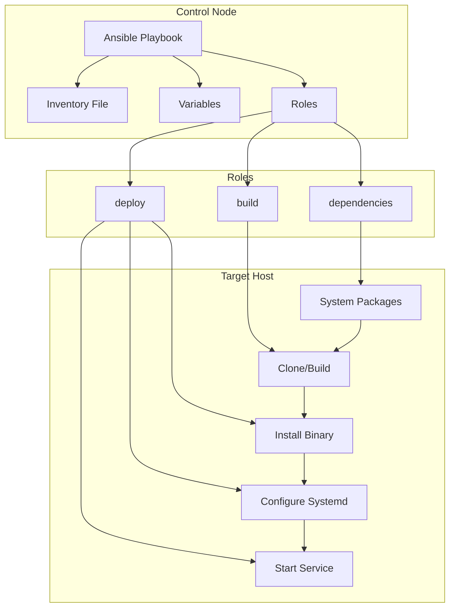

# План: Ansible развертывание GoodByeDPI eBPF

## Обзор

Создание Ansible playbook для автоматизированного развертывания проекта GoodByeDPI eBPF на удалённых хостах с поддержкой дистрибутивов: Debian, Ubuntu, RHEL, Fedora, CentOS, Arch Linux.

## Архитектура развертывания



## Структура директорий

```
ansible/
├── ansible.cfg              # Конфигурация Ansible
├── playbook.yml             # Главный playbook
├── inventory.example        # Пример inventory файла
├── vars/
│   └── main.yml             # Общие переменные
└── roles/
    ├── dependencies/
    │   ├── tasks/
    │   │   └── main.yml     # Установка системных зависимостей
    │   └── defaults/
    │       └── main.yml     # Переменные по умолчанию
    ├── build/
    │   ├── tasks/
    │   │   └── main.yml     # Сборка проекта
    │   └── defaults/
    │       └── main.yml     # Переменные сборки
    └── deploy/
        ├── tasks/
        │   └── main.yml     # Развертывание и настройка
        ├── templates/
        │   └── goodbyedpi.service.j2  # Шаблон systemd unit
        └── defaults/
            └── main.yml     # Переменные развертывания
```

## Детали ролей

### 1. Роль `dependencies`

**Назначение:** Установка всех системных зависимостей для сборки и запуска.

**Задачи:**
- Определение дистрибутива (Debian/Ubuntu, RHEL/Fedora/CentOS, Arch)
- Установка пакетов для Debian/Ubuntu:
  - `clang`, `llvm`, `libbpf-dev`, `linux-headers-$(uname -r)`
  - `bpftool`, `libelf-dev`, `zlib1g-dev`, `make`
  - `build-essential`, `pkg-config`
- Установка пакетов для RHEL/Fedora/CentOS:
  - `clang`, `llvm`, `libbpf-devel`, `kernel-devel`
  - `bpftool`, `elfutils-libelf-devel`, `zlib-devel`, `make`
  - `gcc`, `pkgconfig`
- Установка пакетов для Arch Linux:
  - `clang`, `llvm`, `libbpf`, `linux-headers`
  - `bpftool`, `libelf`, `zlib`, `make`
  - `pkg-config`
- Установка Rust через rustup (если не установлен)
- Проверка версии Rust (минимум 1.75)

### 2. Роль `build`

**Назначение:** Сборка проекта из исходного кода.

**Задачи:**
- Клонирование репозитория (или копирование с control node)
- Проверка BTF поддержки ядра
- Запуск `cargo build --release`
- Верификация собранных бинарников

**Переменные:**
- `goodbyedpi_repo_url` — URL репозитория Git
- `goodbyedpi_version` — ветка или тег для сборки
- `goodbyedpi_build_dir` — директория для сборки

### 3. Роль `deploy`

**Назначение:** Установка бинарников и настройка systemd сервиса.

**Задачи:**
- Копирование бинарников в `/usr/local/bin/`
- Создание директории для конфигурации `/etc/goodbyedpi/`
- Установка systemd unit файла
- Включение и запуск сервиса
- Проверка статуса

**Переменные:**
- `goodbyedpi_interface` — сетевой интерфейс
- `goodbyedpi_config` — строка конфигурации DPI
- `goodbyedpi_user` — пользователь для запуска (опционально)

## Переменные конфигурации

### ansible/vars/main.yml

```yaml
# Версия проекта
goodbyedpi_version: "main"
goodbyedpi_repo_url: "https://github.com/user/ebpf-bye-dpi.git"

# Директории
goodbyedpi_build_dir: "/opt/goodbyedpi"
goodbyedpi_config_dir: "/etc/goodbyedpi"
goodbyedpi_bin_dir: "/usr/local/bin"

# Конфигурация сервиса
goodbyedpi_interface: "eth0"
goodbyedpi_config: "s1 -o1 -Ar -f-1 -r1+s -At -As"
goodbyedpi_debug: false

# Systemd
goodbyedpi_service_enabled: true
goodbyedpi_service_state: "started"
```

## Пример inventory файла

### ansible/inventory.example

```ini
# Одиночный хост
[goodbyedpi]
server1 ansible_host=192.168.1.100 ansible_user=root

# Группа серверов
[goodbyedpi_servers]
server1 ansible_host=192.168.1.100
server2 ansible_host=192.168.1.101
server3 ansible_host=192.168.1.102

[goodbyedpi_servers:vars]
ansible_user=root
ansible_python_interpreter=/usr/bin/python3

# Переменные для конкретного хоста
[goodbyedpi_servers]
web-server ansible_host=10.0.0.5 goodbyedpi_interface=ens18
db-server ansible_host=10.0.0.6 goodbyedpi_interface=enp1s0
```

## Использование

### Базовый запуск

```bash
# Клонирование репозитория на control node
git clone <repo-url>
cd ebpf-bye-dpi

# Создание inventory файла
cp ansible/inventory.example ansible/inventory
# Редактирование inventory под свои хосты

# Запуск развертывания
ansible-playbook -i ansible/inventory ansible/playbook.yml
```

### Запуск с переменными

```bash
# Указание интерфейса и конфигурации
ansible-playbook -i ansible/inventory ansible/playbook.yml \
  -e "goodbyedpi_interface=ens18" \
  -e "goodbyedpi_config=s1 -o1 -g8 -Ar -At -As"

# Только установка зависимостей
ansible-playbook -i ansible/inventory ansible/playbook.yml --tags dependencies

# Только сборка
ansible-playbook -i ansible/inventory ansible/playbook.yml --tags build

# Только развертывание
ansible-playbook -i ansible/inventory ansible/playbook.yml --tags deploy
```

### Проверка без изменений (dry-run)

```bash
ansible-playbook -i ansible/inventory ansible/playbook.yml --check --diff
```

## Требования к окружению

### Control Node (откуда запускается Ansible)
- Ansible 2.12+
- Python 3.8+
- Доступ к целевым хостам по SSH

### Target Hosts (целевые серверы)
- Linux kernel 5.8+ с BTF поддержкой
- SSH доступ с правами root или sudo
- Python 3.6+ (для Ansible modules)

## Проверка BTF поддержки

Перед развертыванием рекомендуется проверить BTF поддержку:

```bash
# На целевом хосте
ls /sys/kernel/btf/vmlinux
# Файл должен существовать

# Или через bpftool
bpftool btf dump file /sys/kernel/btf/vmlinux format c > /dev/null && echo "BTF supported"
```

## Обработка ошибок

Playbook включает обработку типичных ошибок:
- Отсутствие BTF поддержки — предупреждение и остановка
- Несовместимая версия ядра — предупреждение
- Ошибка сборки — вывод лога и остановка
- Отсутствие сетевого интерфейса — предупреждение

## Idempotency

Все задачи в playbook идемпотентны:
- Повторный запуск не ломает существующую установку
- Проверяется наличие пакетов перед установкой
- Проверяется наличие бинарников перед копированием
- Systemd unit обновляется только при изменениях

## Теги для частичного выполнения

| Тег | Описание |
|-----|----------|
| `dependencies` | Только установка системных зависимостей |
| `build` | Только сборка проекта |
| `deploy` | Только развертывание бинарников и настройка сервиса |
| `service` | Только управление systemd сервисом |
| `verify` | Только проверка установки |

## Файловый план

### Файлы для создания:

1. **ansible/ansible.cfg** — конфигурация Ansible
2. **ansible/playbook.yml** — главный playbook
3. **ansible/inventory.example** — пример inventory
4. **ansible/vars/main.yml** — переменные
5. **ansible/roles/dependencies/tasks/main.yml** — задачи зависимостей
6. **ansible/roles/dependencies/defaults/main.yml** — дефолты зависимостей
7. **ansible/roles/build/tasks/main.yml** — задачи сборки
8. **ansible/roles/build/defaults/main.yml** — дефолты сборки
9. **ansible/roles/deploy/tasks/main.yml** — задачи развертывания
10. **ansible/roles/deploy/templates/goodbyedpi.service.j2** — шаблон systemd
11. **ansible/roles/deploy/defaults/main.yml** — дефолты развертывания
12. **ansible/README.md** — документация по использованию

## Следующие шаги

После утверждения плана, переключение в режим Code для создания всех файлов.
